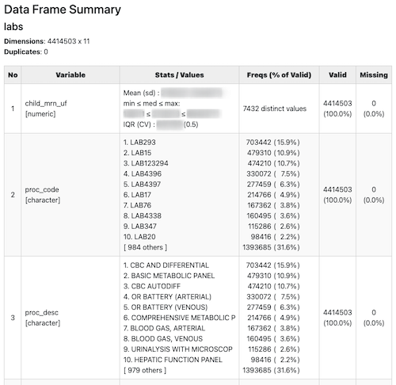

# Pediatric Sequential Organ Failure Assessment (pSOFA) Calculation

## Purpose of Study
The Neonatal Sequential Organ Failure Assessment (nSOFA) score predicts mortality risk among preterm septic neonates, however it has yet to be studied in the general neonatal PICU/PCICU population. The pSOFA has shown similar promise to predict PICU sepsis mortality risk at other centers but has yet to be studied in the general PICU/PCICU population. No comparison of utility between the two scoring systems (nSOFA/pSOFA) has been performed in neonates. This study plans to establish a normal range for pSOFA scores across age groups and in the setting of other disease states. It is unknown if the pSOFA can be improved with implementation of different scoring paradigms and inclusion of other data at a more granular level than once per day.

## About the Data
A retrospective examination of EHR encounter data of all patients below 22 years of age on admission to the UF Health PICU and PCICU from 1/1/2012 to 07/23/20 was used to calculate the pSOFA score and determine if trends can be identified based on demographic features or clinical outcomes.

Data collected includes all laboratory results (including autopsy reports, radiology/ECHO/ultrasound/MRI results, pathology, microbiology, and clinical specimen testing), daily weights, ins/outs, medications, progress notes, operative notes, discharge summaries, vital signs, cardiopulmonary support and all supportive care beginning at the start of the hospital encounter (e.g. emergency department visit) to death or discharge. 

These data were used to calculate the pSOFA score at q1 hour granularity by unit designation (PICU, PCICU) based on clinical parameters including the need for mechanical ventilation, oxygen requirement, requirement for cardiovascular support in the form of vasoactive drugs, and the presence of thrombocytopenia, renal function, neurologic status, and then averaging the score for each patient across different time intervals.

The data was acquired from the University of Florida Integrated Data Repository (IDR) under the aegis of IRB #202001996. The data is not accessible for public use due to PHI restrictions. For developers that have been granted access to this data please contact [James Wynn](james.wynn@peds.ufl.edu), [Philip Chase](pbc@ufl.edu) or [Laurence James-Woodley](lawjames1@ufl.edu) for access to the IDR `source_data` folder of the pSOFA file repository.

The principal investigator on this IRB is James L Wynn. The co-investigators are Lara Nichols and Diomel de la Cruz.

## Analytic Steps
This project is capable of generating pSOFA scores and summary files for any of `picu`, `pcicu` and `nicu` cohorts. For the script to run on a specific cohort the following files are required:
```
encounter.csv
flowsheets.csv
glasgow.csv       # Not needed for NICU cohort
labs.csv
medications.csv
```
Once acquired, all of the files in the `source_data` folder of the pSOFA file repository, for a given cohort, should be placed in the `./data/<cohort>/` folder of this project to allow the analytic tools to run without modification. Note that the default PICU files as provided by the UF IDR do not conform to these names. If you have downloaded the PICU data to `./data/picu`, you can run `./rename_picu_data.sh` to rename those files to the standard names used by the analytic tools.

Build the psofa package included in this repo. either by running `R CMD INSTALL --preclean --no-multiarch --with-keep.source .` at the root of the repo or using RStudio's Build features.

Knit [`data_summary.Rmd`](analysis/data_summary.Rmd) to generate a summary of the input datasets. This will generate a single, tabbed html file with one tab for each input dataset. Each tab will show summary statistics for each column in the input dataset in a display much like this:



Run [`make_psofa_dataset.R`](analysis/make_psofa_dataset.R) to create pSOFA data products from the raw IDR data. These data products are hourly pSOFA scores,
summary pSOFA scores, cardiovascular score at discharge and vasoactive-inotropic score at discharge. All products are stored in their related csv files at 

```
output/<cohort>/<cohort>_psofa_data_<created_date>.csv
output/<cohort>/<cohort>_psofa_summary_<created_date>.csv
output/<cohort>/<cohort>_cv_greater_than_zero_at_discharge_<created_date>.csv
output/<cohort>/<cohort>_vis_greater_than_zero_at_discharge_<created_date>.csv
```

The user has the option to specify the cohort of interest in [`make_psofa_dataset.R`](analysis/make_psofa_dataset.R). Additionally, `analysis/adhoc/` contains scripts created for user specific purposes.

## Score Calculation

### pSOFA Score
See [pSOFA Components and Scoring](psofa_components_and_scoring.pdf) for the scoring system.

### Vasoactive-Inotropic Score (VIS)

The Vasoactive-Inotropic Score (VIS) is calculated according to this equation.

```
VIS = dopamine dose (μg/kg/min) +
      dobutamine dose (μg/kg/min) +
      10 x milrinone dose (μg/kg/min) +
      10 x vasopressin dose (mU/kg/min) +
      100 x epinephrine dose (μg/kg/min) +
      100 x norepinephrine dose (μg/kg/min)
```

# Developer Notes
Software developers who would like to make contributions to this repository should read the [Developer Notes.](developer_notes.md)

